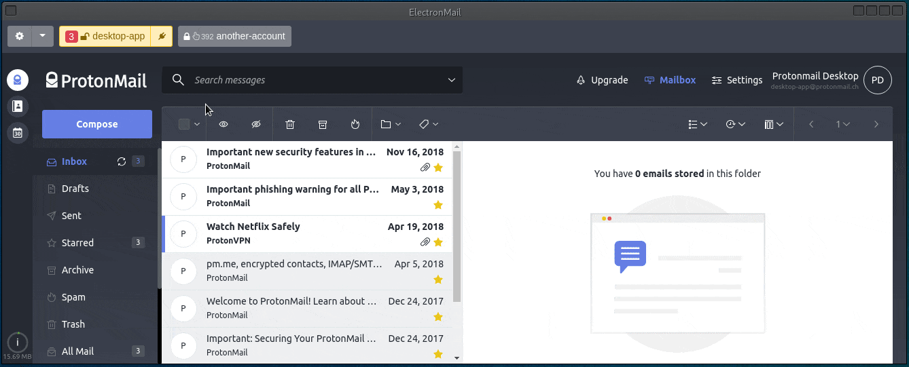

  

ElectronMail is an [Electron](https://electronjs.org)-based unofficial desktop client for [ProtonMail](https://protonmail.com/). The app aims to provide enhanced desktop user experience enabling features that are not supported by the official in-browser web clients. 
It is written in [TypeScript](http://www.typescriptlang.org) and uses [Angular](https://angular.io).

## Download

The download page with Linux/OSX/Windows installation packages is [here](https://github.com/vladimiry/ElectronMail/releases).

The way of verifying that the installation packages attached to the [releases](https://github.com/vladimiry/ElectronMail/releases) have been assembled from the source code [is being provided](https://github.com/vladimiry/ElectronMail/issues/183).

Some Linux package types are available for installing from the repositories (`Pacman` and `Snap` packages are being maintained by [@joshirio](https://github.com/joshirio)):

## Features

- :octocat: **Open Source**.
- :gear: **Reproducible builds**.
- :gear: **Cross platform**. The app works on Linux/OSX/Windows platforms.
- :mag_right: **Full-text search**. Enabled with [v2.2.0](https://github.com/vladimiry/ElectronMail/releases/tag/v2.2.0) release. See the respective [issue](https://github.com/vladimiry/ElectronMail/issues/92) for details.
- :package: **Offline access to the email messages** (only emails body content stored locally but not the attachments). The [local store](https://user-images.githubusercontent.com/1560781/51189497-382a6c00-18f1-11e9-9b9a-baa63f0c0ff4.gif) feature enables storing your messages in the encrypted `database.bin` file, so you could view your messages offline, perform a full-text search against them and export them to EML files. Enabled since [v2.0.0](https://github.com/vladimiry/ElectronMail/releases/tag/v2.0.0) release. 
- :mailbox: **Multi accounts** support per each email provider including supporting individual [entry point domains](https://github.com/vladimiry/ElectronMail/issues/29).
- :unlock: **Automatic login into the app** with a remembered master password using [keytar](https://github.com/atom/node-keytar) module ([keep me signed in](images/keep-me-signed-in.png) feature).
- :unlock: **Automatic login into the email accounts**, including filling [2FA tokens](https://github.com/vladimiry/ElectronMail/issues/10). Two auto-login delay scenarios supported in order to make it harder to correlate the identities, see the respective [issue](https://github.com/vladimiry/ElectronMail/issues/121).
- :unlock: **Persistent email account sessions**. The feature introduced since [v4.2.0](https://github.com/vladimiry/ElectronMail/releases/tag/v4.2.0) version with the `experimental` label, [#227](https://github.com/vladimiry/ElectronMail/issues/227). The feature enables the scenario when you to enter the account credentials on the login form only once, manually or automatically by the app, and then you never see the login form anymore for this email account even if you restart the app (unless you explicitly dropped the session in the admin area or it got dropped by the service due to the inactivity/expiration). If this feature is enabled for the account, manual credentials filling is the preferred option as a more secure option since you don't save the account credentials anywhere (`credentials` are encrypted though even if saved, see `settings.bin` file description in the [FAQ](https://github.com/vladimiry/ElectronMail/wiki/FAQ)).
- :closed_lock_with_key: **Encrypted local storage** with switchable predefined key derivation and encryption presets. Argon2 is used as the default key derivation function.
- :bell: **Native notifications** for individual accounts clicking on which focuses the app window and selects respective account in the accounts list.
- :bell: **System tray icon** with a total number of unread messages shown on top of it. Enabling [local messages store](https://github.com/vladimiry/ElectronMail/issues/32) improves this feature ([how to enable](https://github.com/vladimiry/ElectronMail/releases/tag/v2.0.0-beta.1)), see respective [issue](https://github.com/vladimiry/ElectronMail/issues/30).
- :gear: **Starting minimized to tray**.
- :gear: **Closing to tray**.
- :gear: **Switchable accounts handle buttons positioning** (`top` , `left`, `left-thin`). See details in [#36](https://github.com/vladimiry/ElectronMail/issues/36) and [#175](https://github.com/vladimiry/ElectronMail/issues/175). Demo screenshots placed in the [images](images) folder (specifically [this](images/controls-view-modes-(top-left-left_thing).gif) image).
- :package: **Batch emails export** to EML files (attachments can optionally be exported in online/live mode). Feature released with [v2.0.0-beta.4](https://github.com/vladimiry/ElectronMail/releases/tag/v2.0.0-beta.4) version, requires `local messages store` feature to be enabled ([how to enable](https://github.com/vladimiry/ElectronMail/releases/tag/v2.0.0-beta.1)).
- :closed_lock_with_key: **Built-in/prepackaged web clients**. The prepackaged with the app proton web clients assembled from source code, see the respective [official repositories](https://github.com/ProtonMail/). See [79](https://github.com/vladimiry/ElectronMail/issues/79) and [80](https://github.com/vladimiry/ElectronMail/issues/80) issues for details.
- :gear: **Configuring proxy per account** support. Enabled since [v3.0.0](https://github.com/vladimiry/ElectronMail/releases/tag/v3.0.0) release. See [113](https://github.com/vladimiry/ElectronMail/issues/113) and [120](https://github.com/vladimiry/ElectronMail/issues/120) issues for details.
- :pencil: **Spell Checking**.

## FAQ

You got it [here](https://github.com/vladimiry/ElectronMail/wiki/FAQ).

## How to build your own installation package from source code

### Building on Continuous Integration server

The [reproducible builds](https://en.wikipedia.org/wiki/Reproducible_builds) idea is respected by the project. So the simplest way to prepare your own installation package from the source code is to clone the project and hook it up to the [AppVeyor](https://www.appveyor.com/) and [Travis CI](https://travis-ci.org/) systems. The respective config files [appveyor.yml](appveyor.yml) and [.travis.yml](.travis.yml) come with the project.

### Building locally

- Regardless of the platform you are working on, you will need to have Node.js v12 installed. v12 as it's recommended to go with the same Node.js version Electron comes with. If you already have Node.js installed, but not the v12, then you might want to use [Node Version Manager](https://github.com/creationix/nvm) to be able to switch between multiple Node.js versions:
  - Install [NVM](https://github.com/creationix/nvm).
  - Run `nvm install 12`.
  - Run `nvm use 12`.
- Some native modules require compiling process to be involved and for that Python and C++ compiler need to be installed on the system:
  - On `Windows`: the simplest to install all the needed stuff on Windows is to run `npm install --global --production windows-build-tools` CLI command.
  - On `Linux`: `python v2.7`, `make` and a C/C++ compiler toolchain, like `GCC` are most likely already installed. Besides [keytar](https://github.com/atom/node-keytar) needs `libsecret` library to be installed.
  - On `macOS`: `python v2.7` and [Xcode](https://developer.apple.com/xcode/download/) need to be installed. You also need to install the `Command Line Tools` via Xcode, can be found under the `Xcode -> Preferences -> Downloads` menu.
- ProtonMail's [WebClient](https://github.com/ProtonMail/WebClient) requires addition environment setup if you run Windows, [see](https://github.com/ProtonMail/proton-shared/wiki/setup-windows).
- [Clone](https://help.github.com/articles/cloning-a-repository/) this project to your local device. If you are going to contribute, consider cloning the [forked](https://help.github.com/articles/fork-a-repo/) into your own GitHub account project.
- Install [Yarn](https://yarnpkg.com/en/docs/install).
- Install dependencies running `yarn --pure-lockfile`.
- Build app running `yarn run app:dist`.
- Build a package to install running `yarn run electron-builder:dist` command to build Windows/Mac OS X package and one of the following commands to build Linux package:
  - `yarn run electron-builder:dist:linux:appimage`
  - `yarn run electron-builder:dist:linux:deb`
  - `yarn run electron-builder:dist:linux:freebsd`
  - `yarn run electron-builder:dist:linux:pacman`
  - `yarn run electron-builder:dist:linux:rpm`
  - `yarn run electron-builder:dist:linux:snap`
- The assembled inbstallation package comes into the `./dist` folder.

To recap, considering that all the described build requirements are met, the short command to build let's say Arch Linux package will be `yarn --pure-lockfile && yarn app:dist && yarn electron-builder:dist:linux:pacman`.

## Data/config files created and used by the app

If you want to backup the app data these are only files you need to take care of (files localed in the [settings folder](images/open-settings-folder.jpg)):
- `config.json` file keeps config parameters. There is no sensitive data in this file, so unencrypted.
- `settings.bin` file keeps added to the app accounts including credentials if a user decided to save them. The file is encrypted with 32 bytes length key derived from the master password.
- `database.bin` file is a local database that keeps fetched emails/folders/contacts entities if the `local store` feature was enabled for at least one account. The file is encrypted with 32 bytes length key randomly generated and stored in `settings.bin`. The app by design flushes and loads to memory the `database.bin` file as a whole thing but not like encrypting only the specific columns of the database. It's of course not an optimal approach in terms of performance and resource consumption but it allows keeping the metadata hidden. You can see some details [here](https://github.com/vladimiry/ElectronMail/issues/32).
- `database-session.bin` file is being used in the same way and for the same purpose as `database.bin` but it holds the current session data only. The data from this file will be merged to the `database.bin` on the next app unlocking with the master password.
- `session.bin` file holds the session data of the email accounts. The file is used if the `Persistent Session` feature is enabled for at least one account (the feature introduced since [v4.2.0](https://github.com/vladimiry/ElectronMail/releases/tag/v4.2.0) version with `experimental` label, [#227](https://github.com/vladimiry/ElectronMail/issues/227)). The file is encrypted with 32 bytes length key randomly generated and stored in `settings.bin`.
- `log.log` file keeps log lines. The log level by default is set to `error` (see `config.json` file).

## Removing the app

It's recommended to perform the following actions before uninstalling the app:
- If you had the `Keep me signed in` feature enabled (see [screenshot](images/keep-me-signed-in.png)), click `Log-out` action in the app menu (see [screenshot](images/logout.png)). That will remove locally stored master password (done with [node-keytar](https://github.com/atom/node-keytar)). You can also remove it having the app already uninstalled, but that would be a more complicated way as you will have to manually edit the system's keychain.
- Remove settings folder manually. You can locate settings folder path clicking `Open setting folder` app/tray menu item (see [screenshot](images/open-settings-folder.jpg)) or reading `app.getPath(name ="userData")` related `app.getPath(name)` section [here](https://electronjs.org/docs/api/app#appgetpathname). 
